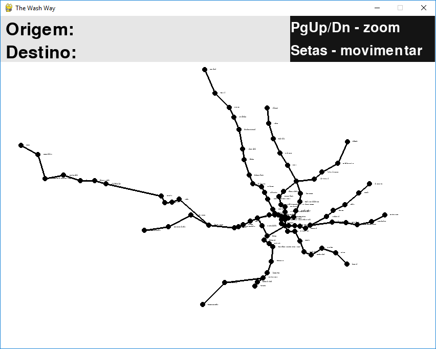
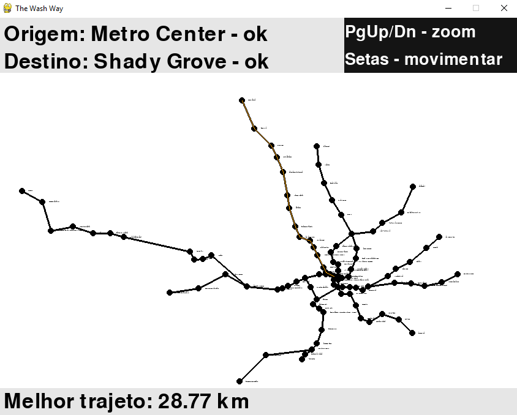

# The Wash Way

O projeto "The Wash Way" foi desenvolvido inteiramente com a utilização da linguagem Python e a adoção de algumas bibliotecas, sendo a principal o Pygame. O projeto tem por finalidade calcular o menor trajeto entre dois pontos, utilizando os conceitos lógicos de grafos e, sobretudo, o algoritmo de Bellman-Ford como principal ferramenta. Utilizamos como suporte a base de dados pública do metrô de Washington D.C. para dar vida ao nosso código e poder realizar as funções necessárias. Sendo assim, cada vértice do grafo se comporta como uma estação de metrô e cada aresta determina a distância entre essas estações. O projeto, mentorado pelo professor Sérgio Queiroz, foi feito a fim da obtenção da nota relativa ao projeto de grafos da disciplina de Algoritmos e Estrutura de Dados do curso de Sistemas de Informação na Universidade Federal de Pernambuco.

## Motivações:

Sabemos que se locomover por uma metrópole tem seus desafios a serem superados diariamente, e, dentro deles, existem alguns mais complexos que outros. Sendo assim, saber qual o menor trajeto entre dois pontos da cidade pode diminuir significativamente o estresse cotidiano, que atinge grande parte da população que utiliza transportes públicos, sobretudo o metrô.

Dentro dessa perspectiva, conversamos entre si e pensamos em traçar uma solução baseada no algoritmo de Bellman-Ford que demonstra a menor distância entre dois vértices, ou melhor, adentrando na atmosfera supracitada, o menor trajeto entre estações de metrô da capital federal norte americana. O metrô da grande Washington possui diversas linhas e estações que abastecem não só a própria cidade, como também cidades vizinhas. Com isso, devido ao grande número de possibilidades de locomoção dentro do sistema, é possível que os passageiros encontrem dúvidas na hora de escolher um trajeto para chegar ao seu destino.

O nome do projeto é um trocadilho com o verbo em inglês "wash" que significa lavar, mas também é uma abreviação da cidade de Washington. Portanto, "The Wash Way" que em tradução literal significaria "a maneira de lavar" ou melhor, a forma de deixar algo mais limpo, ganha outro significado para "a maneira wash" se referindo a forma como a metrópole agora lida com caminhos mais rápidos e eficientes para que sua população se locomove mais rápido em suas redes de transportes públicos ferroviários. Não deixando de ser, assim, também uma maneira de tornar a cidade mais "limpa" sem a sujeira que é o estresse cotidiano vivenciado pela população usuária de metrô. 

## Funcionalidade: 

Para reproduzir o projeto, utilize o arquivo “main.py”. Logo, ao rodar o código, você deve inserir qual a estação de origem e, logo após, qual a estação de destino. Se a entrada oferecida não estiver contida na base de dados, o programa não irá reconhecer. Portanto, ao preencher as informações, certifique-se de que o projeto embarca as estações de metrô da cidade de Washington. Logo, após inserir as estações de origem e destino, o código mostra no mapa o menor trajeto entre as estações escolhidas e a distância entre elas em KM. Você pode dar zoom no mapa utilizando as teclas PgUp/Dn e as setas para movimentar. O trajeto estará destacado na cor laranja.

## Organização do projeto: 

A escolha de Washington como cidade-foco para o desenvolvimento do algoritmo se fez pela sua ampla e organizada base de dados, sua quantidade de vértices e por ser o município que reside um membro da família de um dos integrantes do grupo (que por sua vez pôde nos ajudar em questões práticas sobre o uso e problemáticas reais do metrô na cidade). Disponibilizada pelo Washington Metropolitan Area Transit Authority (https://developer.wmata.com/), a base de dados que contém informações sobre as estações de metrô regionais se mostra de forma bem robusta e direta, além de conter pontos que representam localizações e atributos, criados como parte do Sistema de Informações Geográficas DC (DC GIS) para o Escritório do Diretor de Tecnologia (OCTO) de DC e agências governamentais participantes de DC.

No geral, a base de dados contém, além de todas as estações de metrô da cidade, engloba os seus códigos, localização em longitude e latitude, endereço e linha que cada uma faz parte. Além disso, cada uma das seis linhas (Blue, Green, Orange, Red, Silver e Yellow) possui suas referências em código por linha, nome, estações e a distância entre elas. Dentre toda essa gama de dados que foram essenciais para o desenvolvimento do projeto, as  principais informações que utilizamos foram os nomes das estações e as distâncias entre elas.

## Ferramentas, Bibliotecas e Frameworks utilizados: 

Desenvolvemos o projeto criando um grafo, onde cada vértice representa uma estação de metrô e cada aresta entre estes vértices tem como peso a distância entre eles. Criando assim, a reprodução da malha ferroviária da cidade de Washington e tornando possível a realização do algoritmo. Com isso, utilizamos as bibliotecas JSON para ler a base de dados, Sys para utilidades da janela e Pygame para exibir o programa.

## Observação:

No arquivo "algoritmo.py", caso encontre algum erro, modifique o caminho para os dos arquivos JSON.

## Imagens do projeto rodando:

